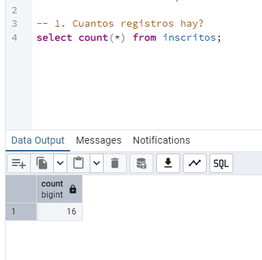
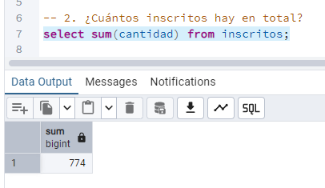
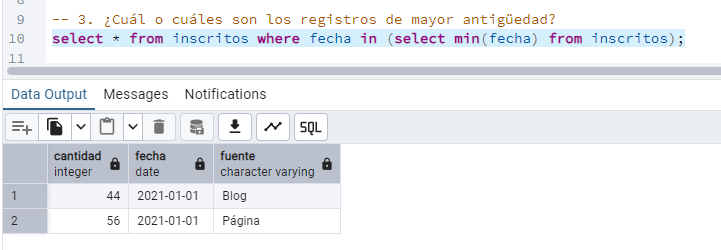
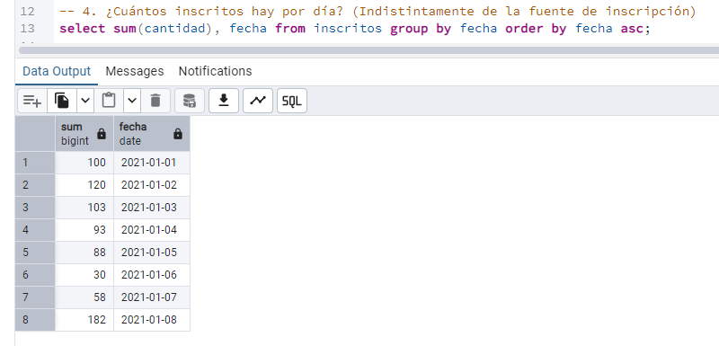
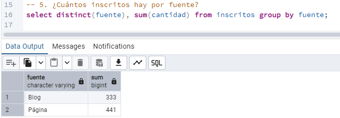
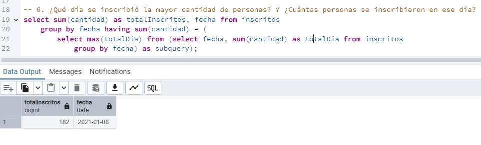
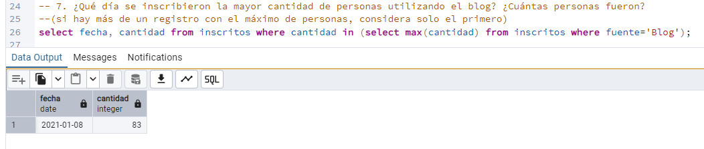
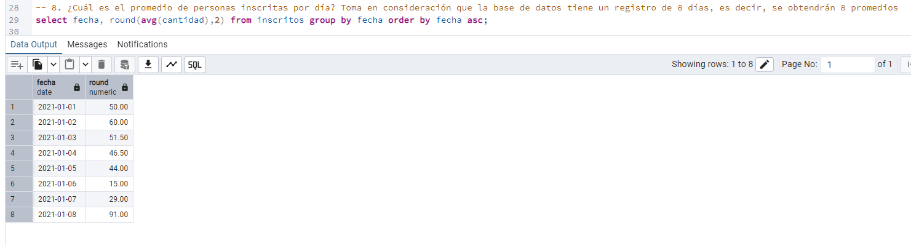
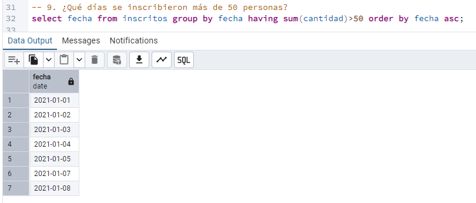
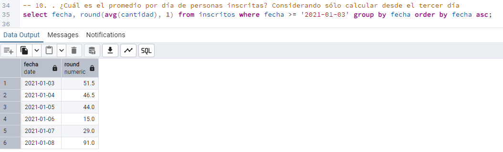

# Desafio 2 - Introduccion a base de datos: Consultas agrupadas

## Script

Se deja a continuación el código con todas las consultas realizadas

```SQL
select * from inscritos;  -- cantidad, fecha, fuente

-- 1. Cuantos registros hay?
select count(*) from inscritos;

-- 2. ¿Cuántos inscritos hay en total?
select sum(cantidad) from inscritos;

-- 3. ¿Cuál o cuáles son los registros de mayor antigüedad?
select * from inscritos where fecha in (select min(fecha) from inscritos);

-- 4. ¿Cuántos inscritos hay por día? (Indistintamente de la fuente de inscripción)
select sum(cantidad), fecha from inscritos group by fecha order by fecha asc;

-- 5. ¿Cuántos inscritos hay por fuente?
select distinct(fuente), sum(cantidad) from inscritos group by fuente;

-- 6. ¿Qué día se inscribió la mayor cantidad de personas? Y ¿Cuántas personas se inscribieron en ese día?
select sum(cantidad) as totalInscritos, fecha from inscritos group by fecha 
    having sum(cantidad) = (
        select max(totalDia) from (select fecha, sum(cantidad) as totalDia from inscritos 
        group by fecha) as subquery
    );

-- 7. ¿Qué día se inscribieron la mayor cantidad de personas utilizando el blog? ¿Cuántas personas fueron? 
--(si hay más de un registro con el máximo de personas, considera solo el primero)
select fecha, cantidad from inscritos where cantidad in (select max(cantidad) from inscritos where fuente='Blog');

-- 8. ¿Cuál es el promedio de personas inscritas por día? Toma en consideración que la base de datos tiene un registro de 8 días, es decir, se obtendrán 8 promedios
select fecha, round(avg(cantidad),2) from inscritos group by fecha order by fecha asc;

-- 9. ¿Qué días se inscribieron más de 50 personas?
select fecha from inscritos group by fecha having sum(cantidad)>50 order by fecha asc;

-- 10. . ¿Cuál es el promedio por día de personas inscritas? Considerando sólo calcular desde el tercer día
select fecha, round(avg(cantidad), 1) from inscritos where fecha >= '2021-01-03' group by fecha order by fecha asc;
```

## Capturas

A continuación se dejan las capturas de pantalla que muestran la ejecución de cada query del script

1. Cuantos registros hay?


2. ¿Cuántos inscritos hay en total?


3. ¿Cuál o cuáles son los registros de mayor antigüedad?


4. ¿Cuántos inscritos hay por día? (Indistintamente de la fuente de inscripción)


5. ¿Cuántos inscritos hay por fuente?


6. ¿Qué día se inscribió la mayor cantidad de personas? Y ¿Cuántas personas se inscribieron en ese día?


7. ¿Qué día se inscribieron la mayor cantidad de personas utilizando el blog? ¿Cuántas personas fueron? (si hay más de un registro con el máximo de personas, considera solo el primero)


8. ¿Cuál es el promedio de personas inscritas por día? Toma en consideración que la base de datos tiene un registro de 8 días, es decir, se obtendrán 8 promedios


9. ¿Qué días se inscribieron más de 50 personas?


10. . ¿Cuál es el promedio por día de personas inscritas? Considerando sólo calcular desde el tercer día

